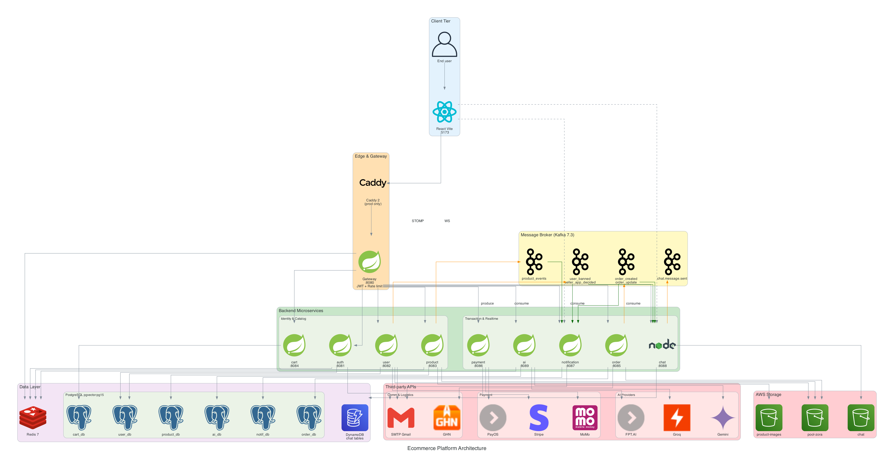

# 🛍️ ZORA - Distributed E-Commerce Ecosystem

  


ZORA is a comprehensive, distributed e-commerce platform designed for high performance, scalability, and an enriched user experience. Originally architected as a university graduation capstone project, this platform leverages a polyglot microservices approach, utilizing **Java Spring Boot** for core backend operations, robust event-driven architecture with **Kafka**, and Docker for seamless containerization.

## 📥 Live Demo & Application

- 🌐 **Web Storefront:** [https://zora-ecommerce-ecosystem.vercel.app](https://zora-ecommerce-ecosystem.vercel.app)
- 📱 **Mobile App (Android APK):** [Link_Download_APK_Here](#) *(Currently building via Expo EAS...)*

---

## 🌟 Deep-Dive Features

### 1. Robust Payment & Order Management
- **Multi-Gateway Payment:** Integrated with **PayOS** and **Stripe** and **Momo** for diverse, secure checkout options.
- **Microservices Orchestration:** Fully decoupled services (Cart, Order, Payment, Notification) communicating asynchronously via Apache Kafka.
- **Dispute & Refund Logic:** Automated status tracking with reliable rollback mechanisms.

### 2. Real-Time Communication & WebRTC
- **Omnichannel Chat:** Persistent real-time messaging synchronized across Web and Mobile.
- **Group & 1-to-1 Video Calls:** Robust WebRTC implementation with custom TURN/STUN server configurations.
- **Media Handling:** Seamless image attachments, PDF rendering, and AWS S3 integration.

### 3. AI-Powered Shopping Assistant
- **Intelligent Chatbot:** Integrated AI service (utilizing pgvector for vector search and LLMs) capable of answering product queries, guiding users through the catalog, and handling customer support.

### 4. Distributed Microservices Architecture
- **Java Spring Boot Core:** Over 8 independent microservices (Gateway, Auth, User, Product, Cart, Order, Payment, Notification).
- **Event-Driven:** Apache Kafka + Zookeeper integration for robust inter-service communication.
- **Containerization:** Fully containerized backend infrastructure orchestrated via Docker Compose.

---

## 🏗 System Architecture (Monorepo)



### Workspace Breakdown
- 📂 **`/ecommerce-backend`**: Core backend infrastructure containing all Java Spring Boot microservices, Kafka setup, and Docker configuration files.
- 📂 **`/ecommerce-frontend`**: Responsive web application serving as the main storefront and administrative dashboard.
- 📂 **`/ecommerce-mobile`**: Cross-platform mobile application featuring complex UI flows like QR code group joining and media attachments.
- 📂 **`/ecommerce-node-service`**: (Optional) Dedicated service for specific real-time operations if decoupled from the main Java Chat service.

---

## 🚀 Comprehensive Tech Stack

| Domain | Technologies |
| :--- | :--- |
| **Frontend (Web)** | React, Next.js / Vite, TailwindCSS |
| **Frontend (Mobile)**| React Native, Expo, React Navigation |
| **Backend Core** | Java, Spring Boot, Spring Cloud Gateway |
| **Message Broker** | Apache Kafka, Zookeeper |
| **Databases** | PostgreSQL (pgvector), Redis (Caching) |
| **External APIs** | PayOS, Stripe, OpenAI / LLM APIs, AWS S3 |
| **DevOps & Cloud** | Docker, Docker Compose, AWS EC2, Vercel, Expo EAS |

---

## ⚙️ Local Development Setup

### Prerequisites
- Docker & Docker Compose
- Node.js (v18+) & Package manager (`npm` or `yarn`)
- Java 17+ & Maven
- Expo CLI

### 1. Start Backend Infrastructure (Docker)
The entire backend ecosystem (PostgreSQL, Redis, Kafka, and all Java Microservices) is containerized.
```bash
cd ecommerce-backend
# Make sure to configure your .env file here first based on .env.prod.example
docker-compose up --build -d
```
*Note: This will spin up the Gateway on port 8080 and initialize the database via `init-db.sql`.*

### 2. Start Web Application
```bash
cd ecommerce-frontend
npm install
npm run dev
```

### 3. Start Mobile Application
```bash
cd ecommerce-mobile
npm install
npx expo start
```

---

## 📈 Deployment Strategy

1. **Backend Services (AWS EC2):** Clone the repository to your EC2 instance and run `docker-compose -f docker-compose.prod.yml up -d` to launch the scalable microservices network.
2. **Web Frontend (Vercel):** Point the Vercel project to this repository and set the *Root Directory* to `ecommerce-frontend`.
3. **Mobile App (EAS):** Navigate to `ecommerce-mobile` and utilize Expo Application Services (`eas build`) for cloud APK/AAB generation.

---
*Architected and developed as a university thesis demonstrating advanced system design, event-driven architecture, and scalable deployment strategies.*
